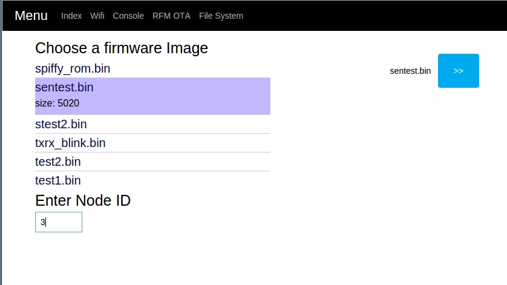

# ESP-RFM69

## Overview

RFM69 driver and web interface for the ESP8266. Note - this is fairly dated (old SDK), but should still work with 1.5.x.


## Features:

* RFM69 driver for ESP8266
* NGINX-style HTTP server, serving files from SPIFFS
* RFM webapp for sending basic text, viewing received messages
* RFM69 OTA update utility, Moteino compatible
* SPIFFFS webapp:
   - Drag-and-drop file uploader based on websockets
   - Styled file viewer
   - Download files
   - Delete files
* SPIFFY-based ROM creator with gzip, html, css, js compression
* Web interface for WiFi
* Built with Espressif's NONOS SDK v1.5.2 and NONOS lwip 1.5.2 module


## Bugs & Limitations:

* Have not tested anything other than 66-byte encrypted packet mode. YMMV
* File System uploader crashes on occasion. Probably not too difficult to
   fix but I haven't had time.
* Static Javascript is a bit messy and probably a bit buggy. Still getting the
   hang of web development.
* WiFi change and event monitor needs to be fixed or perhaps re-written
* This is not compatible with esp-arduino, but others have said that the
   RFM69 driver at lowpowerlab.com now works flawlessly.


## Credits:

Any and all contributers to/authors of the various modules used in this project
(see list below/LICENSE file). But particularly:

* Felix Rusu at LowPowerLab.com for creating the Moteino framework, RFM69 driver,
   and in particular all the work he has put in to Wireless Programming.
* Spritetm for his contribution of esp-httpd, and Israel Lot for his
   NGINX-flavor rework of esp-httpd.
* SPIFFS author [pellepl](https://github.com/pellepl/spiffs) for creating SPIFFS and making
   himself more than available for help and support.
* Espressif for the awesome, cheap chip and English documentation
* Max Filippov and Paul Sokolovsky (pfalcon) for open-sourcing this bad boy.


## Installation

See [Wiki](https://github.com/someburner/esp-rfm69/wiki/Installation).


## Serial Monitor:

Default baud rate is 74880. After user_init is called, it goes to 115200.
If platformIO is installed, serial monitor can be invoked as such
(replace /dev/ftdi_esp with your com port):

```sh
platformio serialports monitor -b 115200 -p /dev/ftdi_esp
```


## Moteino OTA:

See [Moteino_OTA](https://github.com/someburner/esp-rfm69/wiki/Moteino-OTA)


## MQTT

See [MQTT](https://github.com/someburner/esp-rfm69/wiki/MQTT). This is a very ugly, hard-coded implementation, sorry.


## SPI Flash Info

The flash chips packaged with esp-xx modules can be of various sizes and come
from various manufacturers. To get flash ID (as hex):

```
uint32 flash_id = spi_flash_get_id();
NODE_DBG("Flash_ID = %x", flash_id);
```

**Layout:**

- `0x000000 - 0x010000`:   64KB - Bootloader, SDK
- `0x010000 - 0x080000`:  448KB - Rom0
- `0x080000 - 0x090000`:   64KB - Static FS (HTML, initial config)
- `0x090000 - 0x1DC000`: 1328KB - Dynamic FS (All other files)
- `0x1FC000 - 0x200000`:  Unused (SDK config)


## SPIFFS:

The address to flash SPIFFS must (I think) be on a proper multiple of the
logical block size, and must not overlap with irom at all.

[TECH SPEC](https://github.com/pellepl/spiffs/blob/master/docs/TECH_SPEC)


## Pin Configurations

**Bold** == for flashing only

### RFM69

| RFM69HW | ESP-12E |
| ------- | --------|
| MISO    | GPIO12  |
| MOSI    | GPIO13  |
| SCK     | GPIO14  |
| CS/SS   | GPIO15  |
| DIO0    | GPIO5   |

### GPIO

| I/O          | ESP-12E  |
| ------------ | -------- |
| 10K PULLUP   | CH_PD/EN |
| 10K PULLDOWN | GPIO15   |
| **10K PULLDOWN** | GPIO0    |
| BUTTON-GND   | RST      |


## Debug Tools

* [Allow COORS in Chrome](https://chrome.google.com/webstore/detail/allow-control-allow-origi/nlfbmbojpeacfghkpbjhddihlkkiljbi/related?hl=en)
* [Brackets HTML/CSS/JS Editor](http://brackets.io/)


## Module List

* [MQTT](https://github.com/tuanpmt/esp_mqtt)
* [SPIFFS](https://github.com/pellepl/spiffs)
* [NODEMCU](https://github.com/nodemcu/nodemcu-firmware/tree/dev)
* [cJSON](https://github.com/kbranigan/cJSON)
* [cbuff-module](https://github.com/codinghead/cbuff-module)
* [ESP-Ginx](https://github.com/israellot/esp-ginx)
* [HTTP Parser](https://github.com/nodejs/http-parser)
* [Espressif SDK](http://bbs.espressif.com/viewforum.php?f=46&sid=542472662ff3f73241d8301c4c2d7f15)
* [SPI Driver](https://github.com/MetalPhreak/ESP8266_SPI_Driver)


## Preview

### Console


### File System


### Uploader


### OTA Updater

